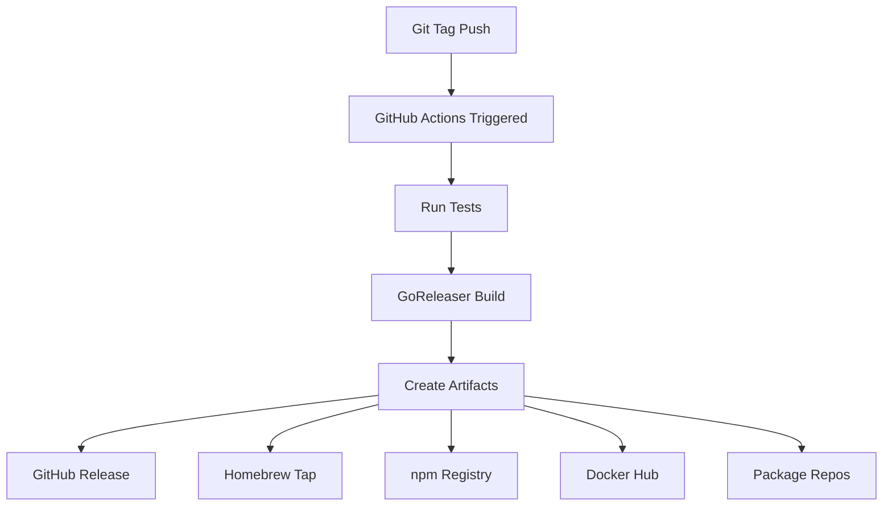

# Distribution Infrastructure

This document explains scmd's distribution infrastructure, covering all the channels we use to deliver scmd to users.

## Overview

scmd is distributed through multiple channels to reach users on different platforms:

- **Homebrew** - macOS and Linux package manager
- **npm** - Cross-platform via Node.js
- **Shell scripts** - Universal wget/curl installer
- **Linux packages** - Native deb, rpm, and apk packages
- **GitHub Releases** - Direct binary downloads
- **Docker Hub** - Container images

## Architecture

### Build Pipeline



### File Structure

```
.
├── .goreleaser.yml              # GoReleaser configuration
├── .github/workflows/
│   └── release.yml              # Release automation
├── scripts/
│   ├── install.sh               # Universal installer
│   ├── uninstall.sh             # Uninstaller
│   ├── postinstall.sh           # Package post-install
│   └── preremove.sh             # Package pre-remove
├── npm/
│   ├── package.json             # npm package config
│   ├── install.js               # Binary downloader
│   └── uninstall.js             # Cleanup script
└── Makefile                     # Build targets
```

## Distribution Channels

### 1. Homebrew

**Repository**: [scmd/homebrew-tap](https://github.com/scmd/homebrew-tap)

#### How It Works

1. GoReleaser generates Homebrew formula
2. Pushes to `scmd/homebrew-tap` repository
3. Formula includes:
   - Binary URL and checksums
   - Dependencies (suggests llama.cpp)
   - Install scripts
   - Shell completions

#### Formula Structure

```ruby
class Scmd < Formula
  desc "AI-powered slash commands for any terminal"
  homepage "https://github.com/scmd/scmd"
  url "https://github.com/scmd/scmd/releases/download/v1.0.0/scmd_1.0.0_macOS_arm64.tar.gz"
  sha256 "abc123..."
  license "MIT"

  depends_on "llama.cpp" => :recommended

  def install
    bin.install "scmd"
    bash_completion.install "completions/scmd.bash" => "scmd"
    zsh_completion.install "completions/scmd.zsh" => "_scmd"
    fish_completion.install "completions/scmd.fish"
  end

  test do
    system "#{bin}/scmd", "--version"
  end
end
```

#### User Installation

```bash
brew tap scmd/tap
brew install scmd
```

#### Configuration

In `.goreleaser.yml`:

```yaml
brews:
  - name: scmd
    repository:
      owner: scmd
      name: homebrew-tap
      token: "{{ .Env.HOMEBREW_TAP_GITHUB_TOKEN }}"
    directory: Formula
    homepage: https://github.com/scmd/scmd
    description: "AI-powered slash commands for any terminal"
    license: MIT
    install: |
      bin.install "scmd"
      bash_completion.install "completions/scmd.bash" => "scmd"
      zsh_completion.install "completions/scmd.zsh" => "_scmd"
      fish_completion.install "completions/scmd.fish"
    dependencies:
      - name: llama.cpp
        type: optional
```

### 2. npm Registry

**Package**: [scmd-cli](https://www.npmjs.com/package/scmd-cli)

#### How It Works

1. User runs `npm install -g scmd-cli`
2. npm runs `postinstall` script
3. `install.js` detects platform and architecture
4. Downloads appropriate binary from GitHub releases
5. Verifies checksums
6. Installs to `npm/bin/`
7. npm adds to user's PATH

#### Package Structure

```json
{
  "name": "scmd-cli",
  "version": "1.0.0",
  "bin": {
    "scmd": "bin/scmd"
  },
  "scripts": {
    "postinstall": "node install.js",
    "preuninstall": "node uninstall.js"
  }
}
```

#### install.js Logic

```javascript
// Detect platform
const platform = process.platform; // darwin, linux, win32
const arch = process.arch;         // x64, arm64

// Map to GitHub release names
const binaryName = `scmd_${version}_${platform}_${arch}.tar.gz`;

// Download from GitHub
const url = `https://github.com/scmd/scmd/releases/download/v${version}/${binaryName}`;

// Verify checksum
downloadChecksums();
verifyChecksum(binaryPath);

// Extract and install
extractArchive(binaryPath, 'npm/bin/');
```

#### User Installation

```bash
npm install -g scmd-cli
```

### 3. Shell Install Script

**Location**: `scripts/install.sh`

#### How It Works

1. User runs `curl -fsSL https://scmd.sh/install.sh | bash`
2. Script detects OS and architecture
3. Downloads binary and checksums from GitHub
4. Verifies SHA256 checksum
5. Installs to `/usr/local/bin` (with sudo) or `~/.local/bin`
6. Installs shell completions
7. Checks PATH configuration

#### Features

- Platform detection (macOS, Linux, Windows)
- Architecture detection (amd64, arm64)
- Checksum verification
- Custom install directory
- No-sudo mode
- Version selection

#### Environment Variables

```bash
SCMD_INSTALL_DIR=/custom/path    # Custom installation directory
SCMD_VERSION=v1.0.0              # Specific version
SCMD_NO_SUDO=true                # User-local install
```

#### User Installation

```bash
# Default installation
curl -fsSL https://scmd.sh/install.sh | bash

# Custom installation
curl -fsSL https://scmd.sh/install.sh | SCMD_INSTALL_DIR=$HOME/bin bash
```

### 4. Linux Packages

#### Supported Formats

- **deb** - Debian, Ubuntu, Linux Mint
- **rpm** - Red Hat, Fedora, CentOS, SUSE
- **apk** - Alpine Linux

#### How It Works

1. GoReleaser uses [nfpm](https://nfpm.goreleaser.com/) to create packages
2. Packages include:
   - Binary in `/usr/bin/scmd`
   - Shell completions in `/usr/share/`
   - Man pages (future)
   - Post-install scripts

#### Configuration

In `.goreleaser.yml`:

```yaml
nfpms:
  - id: scmd
    package_name: scmd
    vendor: scmd
    homepage: https://github.com/scmd/scmd
    maintainer: scmd team <team@scmd.dev>
    description: "AI-powered slash commands for any terminal"
    license: MIT
    formats:
      - deb
      - rpm
      - apk
    bindir: /usr/bin
    contents:
      - src: ./scmd
        dst: /usr/bin/scmd
      - src: ./completions/scmd.bash
        dst: /usr/share/bash-completion/completions/scmd
    scripts:
      postinstall: "scripts/postinstall.sh"
      preremove: "scripts/preremove.sh"
    recommends:
      - llama-cpp
```

#### Package Metadata

**Debian (.deb)**:

```
Package: scmd
Version: 1.0.0
Architecture: amd64
Maintainer: scmd team <team@scmd.dev>
Description: AI-powered slash commands for any terminal
Depends:
Recommends: llama-cpp
```

**RPM (.rpm)**:

```
Name: scmd
Version: 1.0.0
Release: 1
Summary: AI-powered slash commands for any terminal
License: MIT
Recommends: llama-cpp
```

#### User Installation

```bash
# Debian/Ubuntu
sudo dpkg -i scmd_1.0.0_linux_amd64.deb

# Red Hat/Fedora
sudo rpm -i scmd_1.0.0_linux_amd64.rpm

# Alpine
sudo apk add --allow-untrusted scmd_1.0.0_linux_amd64.apk
```

### 5. GitHub Releases

#### Artifacts

Each release includes:

- **Binaries** for all platforms
- **Archives** (.tar.gz for Unix, .zip for Windows)
- **Checksums** (SHA256)
- **Release notes** (auto-generated from commits)
- **Linux packages** (deb, rpm, apk)

#### Release Structure

```
v1.0.0
├── scmd_1.0.0_macOS_amd64.tar.gz
├── scmd_1.0.0_macOS_arm64.tar.gz
├── scmd_1.0.0_linux_amd64.tar.gz
├── scmd_1.0.0_linux_arm64.tar.gz
├── scmd_1.0.0_windows_amd64.zip
├── scmd_1.0.0_linux_amd64.deb
├── scmd_1.0.0_linux_amd64.rpm
├── scmd_1.0.0_linux_amd64.apk
├── checksums.txt
└── Release Notes
```

#### Checksum Verification

Users can verify downloads:

```bash
# Download checksums
wget https://github.com/scmd/scmd/releases/download/v1.0.0/checksums.txt

# Verify
shasum -a 256 -c checksums.txt 2>&1 | grep scmd_1.0.0_macOS_arm64.tar.gz
```

### 6. Docker Hub

**Repository**: [scmd/scmd](https://hub.docker.com/r/scmd/scmd)

#### Multi-Arch Images

```bash
scmd/scmd:latest        # Latest release
scmd/scmd:1.0.0         # Specific version
scmd/scmd:1.0.0-amd64   # Platform-specific
scmd/scmd:1.0.0-arm64   # Platform-specific
```

#### Dockerfile

```dockerfile
FROM alpine:latest

RUN apk add --no-cache ca-certificates

COPY scmd /usr/local/bin/scmd

ENTRYPOINT ["scmd"]
```

#### User Usage

```bash
# Run scmd in Docker
docker run scmd/scmd:latest --version

# Interactive
docker run -it scmd/scmd:latest /explain "what is a goroutine"
```

## Binary Naming Convention

### Platforms

- `macOS` - macOS (formerly darwin)
- `linux` - Linux
- `windows` - Windows

### Architectures

- `amd64` - x86_64, Intel/AMD 64-bit
- `arm64` - ARM 64-bit (Apple Silicon, ARM servers)

### Archive Names

Pattern: `scmd_{VERSION}_{OS}_{ARCH}.{EXT}`

Examples:

- `scmd_1.0.0_macOS_arm64.tar.gz`
- `scmd_1.0.0_linux_amd64.tar.gz`
- `scmd_1.0.0_windows_amd64.zip`

## Installation Paths

### System-Wide

```
/usr/local/bin/scmd                              # Binary (macOS, manual)
/usr/bin/scmd                                    # Binary (Linux packages)
/usr/local/share/bash-completion/completions/   # Bash completions
/usr/local/share/zsh/site-functions/            # Zsh completions
/usr/share/fish/vendor_completions.d/           # Fish completions
```

### User-Local

```
~/.local/bin/scmd                    # Binary
~/.bash_completion.d/                # Bash completions
~/.config/fish/completions/          # Fish completions
```

### Data Directory

```
~/.scmd/                             # Default data directory
$XDG_CONFIG_HOME/scmd/              # XDG config
$XDG_DATA_HOME/scmd/                # XDG data
$XDG_CACHE_HOME/scmd/               # XDG cache
```

## Shell Completions

### Generation

Completions are generated using Cobra:

```go
// In cmd/completion/completion.go
cmd.GenBashCompletion(os.Stdout)
cmd.GenZshCompletion(os.Stdout)
cmd.GenFishCompletion(os.Stdout, true)
cmd.GenPowerShellCompletionWithDesc(os.Stdout)
```

### Installation

#### Homebrew

Automatically installs completions during `brew install`.

#### Linux Packages

Completions included in deb/rpm/apk packages.

#### Manual

```bash
scmd completion bash > ~/.bash_completion.d/scmd
scmd completion zsh > ~/.zsh/completion/_scmd
scmd completion fish > ~/.config/fish/completions/scmd.fish
```

## Security

### Checksum Verification

All releases include SHA256 checksums:

```bash
# checksums.txt format
abc123... scmd_1.0.0_macOS_arm64.tar.gz
def456... scmd_1.0.0_linux_amd64.tar.gz
```

### Binary Signing (Future)

Plan to add GPG signing:

```yaml
signs:
  - artifacts: checksum
    args:
      - "--batch"
      - "--local-user"
      - "{{ .Env.GPG_FINGERPRINT }}"
```

### Supply Chain Security

- Builds run in GitHub Actions (auditable)
- Reproducible builds with GoReleaser
- Checksums for all artifacts
- HTTPS for all downloads

## Monitoring

### Release Health

After each release, verify:

- [ ] GitHub release created
- [ ] All platform binaries present
- [ ] Checksums correct
- [ ] Homebrew tap updated
- [ ] npm package published
- [ ] Docker images pushed
- [ ] Download URLs work
- [ ] Installation methods tested

### Analytics

Track (future):

- Download counts per platform
- Installation method distribution
- Version adoption rates
- Geographic distribution

## Maintenance

### Updating Dependencies

#### Homebrew

```ruby
# In Formula/scmd.rb
depends_on "llama.cpp" => :recommended
```

#### npm

```json
// In npm/package.json
"engines": {
  "node": ">=14.0.0"
}
```

#### Linux Packages

```yaml
# In .goreleaser.yml
recommends:
  - llama-cpp
```

### Deprecating Versions

#### npm

```bash
npm deprecate scmd-cli@1.0.0 "Critical bug, please upgrade"
```

#### GitHub

Add warning to release notes.

## Future Improvements

### Planned

- [ ] Publish to Homebrew core (not just tap)
- [ ] APT/YUM repositories (not just releases)
- [ ] Snap packages
- [ ] Flatpak
- [ ] Windows package managers (Chocolatey, Scoop, winget)
- [ ] Binary signing with GPG
- [ ] SLSA provenance
- [ ] Software Bill of Materials (SBOM)

### Under Consideration

- [ ] Arch User Repository (AUR)
- [ ] Nix packages
- [ ] Guix packages
- [ ] Gentoo ebuild
- [ ] FreeBSD ports

## Troubleshooting

### Homebrew Tap Issues

**Problem**: Tap not updating

**Solution**:

```bash
# Force tap update
brew update
brew upgrade scmd

# Or reinstall
brew uninstall scmd
brew install scmd
```

### npm Binary Download Issues

**Problem**: Binary download fails

**Solution**:

Check GitHub connectivity:

```bash
curl -I https://github.com
curl -I https://github.com/scmd/scmd/releases/download/v1.0.0/checksums.txt
```

### Package Installation Fails

**Problem**: Linux package won't install

**Solution**:

Check package format and architecture:

```bash
# Check file type
file scmd_1.0.0_linux_amd64.deb

# Check architecture
dpkg --print-architecture
uname -m
```

## References

- [GoReleaser Documentation](https://goreleaser.com)
- [nfpm Documentation](https://nfpm.goreleaser.com)
- [Homebrew Formula Cookbook](https://docs.brew.sh/Formula-Cookbook)
- [npm Package Creation](https://docs.npmjs.com/creating-and-publishing-unscoped-public-packages)
- [Debian Package Guidelines](https://www.debian.org/doc/manuals/maint-guide/)
- [RPM Packaging Guide](https://rpm-packaging-guide.github.io/)
